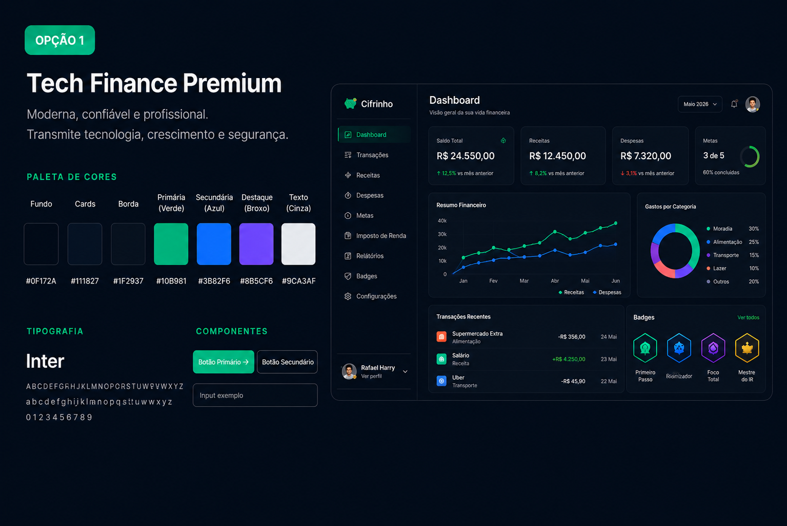

# 🎨 Cifrinho — Proposta de Design System

## Objetivo
Definir uma identidade visual moderna, confiável e tecnológica para a plataforma Cifrinho, alinhada com o conceito de gestão financeira híbrida (pessoal + empresarial).

---

# 🔥 Direção Visual

A proposta da interface é transmitir:

- Modernidade
- Confiança financeira
- Tecnologia
- Clareza visual
- Experiência intuitiva
- Sensação de produto SaaS premium

Referências:

- Stripe
- Linear
- Nubank
- Inter
- Notion
- Dashboards fintech modernos

---

# 🎨 Identidade Visual Oficial — Tech Finance Premium

## Conceito

Visual elegante e profissional, focado em transmitir segurança financeira e tecnologia.

A identidade visual escolhida busca transmitir:

- modernidade
- confiança
- tecnologia
- sofisticação
- experiência premium

---

# 🎨 Paleta Oficial

| Elemento | Cor |
|---|---|
| Background | `#0F172A` |
| Cards | `#111827` |
| Bordas | `#1F2937` |
| Primária (Verde) | `#10B981` |
| Secundária (Azul) | `#3B82F6` |
| Destaque (Roxo) | `#8B5CF6` |
| Texto Principal | `#F9FAFB` |
| Texto Secundário | `#9CA3AF` |

---

# ✍️ Tipografia

## Fonte principal

### Inter

Motivos:

- Excelente legibilidade
- Moderna
- Muito utilizada em produtos SaaS
- Ótima para dashboards

---

# 🧩 Componentes

## Botões   

- Border radius: `12px`
- Transição suave: `0.2s`
- Hover moderno
- Sombras leves

## Cards

- Layout clean
- Muito espaçamento
- Ícones minimalistas
- Informações organizadas

## Inputs

- Estilo minimalista
- Bordas discretas
- Feedback visual no focus

---

# 📏 Espaçamento

## Escala sugerida

```txt
4px
8px
12px
16px
24px
32px
48px
```

---

## 🔲 Border Radius

```txt
sm = 8px
md = 12px
lg = 16px
xl = 24px
```

---

# 🎨 Preview Visual


